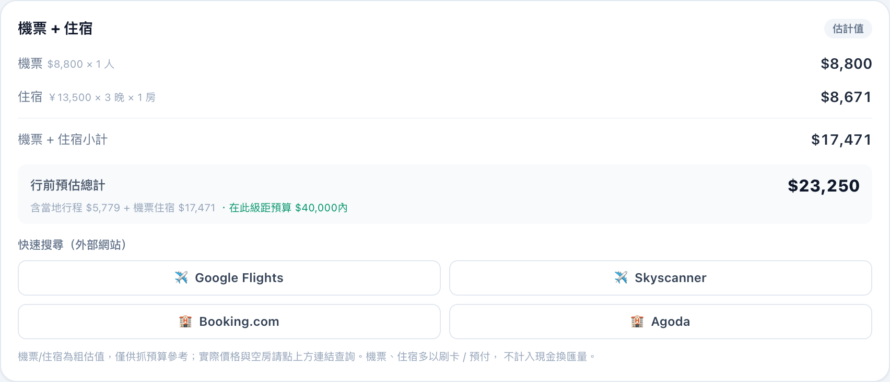
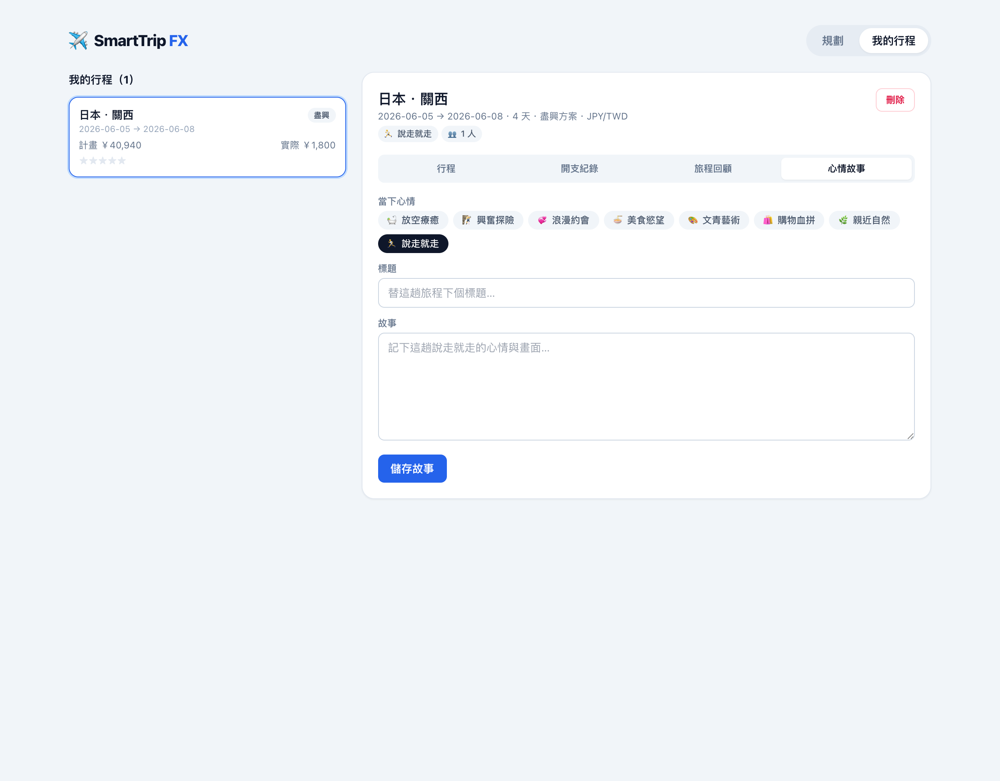

# SmartTrip FX ✈️

一個**簡單、快速的個人旅程規劃器**，給「想臨時逃離一下」的人。挑個心情與預算範圍，一鍵生成 **Low / Mid / High** 三種方案，並精算「不浪費、不匯損」的精準現金換匯量；還能把行程存下來、記帳、寫回顧與心情故事。


[](https://vercel.com/new/clone?repository-url=https%3A%2F%2Fgithub.com%2Fhpyuan1220%2Fsmarttrip-fx&env=OPENAI_API_KEY,OPENAI_MODEL,EXCHANGE_API_KEY&envDescription=OpenAI%20%E8%88%87%E5%8C%AF%E7%8E%87%20API%20%E9%87%91%E9%91%B0%EF%BC%88%E5%85%A8%E9%83%A8%E9%81%B8%E5%A1%AB%EF%BC%89&project-name=smarttrip-fx&repository-name=smarttrip-fx)





## 功能

### 規劃
- **依心情規劃**：選擇**心情、主題、同行成分、人數**與**預算範圍**，量身生成行程。
- **Low / Mid / High 三方案**：由預算範圍自動產生輕簡 / 標準 / 盡興三種級距，各自有不同花費與建議換匯量，一鍵切換比較。
- **多目的地 + 30+ 幣別**：內建關西 / 東京 / 首爾 / 曼谷 / 巴黎 / 倫敦 / 杜拜…等預設(也可自訂)；消費幣別支援 30+ 種常見旅遊貨幣，本國幣別預設 TWD。選目的地自動帶入預設幣別，可手動覆蓋。
- **行程時間軸**：每日卡片標註景點、預估花費(依消費幣別格式化)與支付標籤(刷卡 / 現金)。
- **財務面板**：大字顯示「建議換匯量」、FX 換匯紅綠燈（STRONG_BUY / BUY / HOLD）與文字建議。
- **機票 + 住宿**：依級距 / 地區 / 人數 / 晚數粗估機票與住宿成本，算出「行前預估總計」(當地行程 + 機票 + 住宿)並對比預算；附 Google Flights / Skyscanner / Booking.com / Agoda 一鍵搜尋連結(自動帶入目的地與日期)。機票住宿多為刷卡 / 預付，不計入現金換匯。

### 紀錄與回顧（資料存在本機瀏覽器，免登入）
- **SaveTrip**：把選定的方案存進「我的行程」。
- **開支紀錄**：旅途中隨手記帳(現金 / 刷卡)，即時對比**計畫 vs 實際**、超支 / 結餘、建議現金 vs 實際現金。
- **旅程回顧**：星等評分 + 心得(最棒的部分、預算心得、備註)。
- **心情故事**：用心情標籤 + 標題 + 內文，記下這趟說走就走的心情。

### 引擎
- **AI 行程生成**：`/api/generate` 以嚴格 `json_object` 提示詞呼叫 OpenAI，依心情/主題/同行/人數/預算生成帶 `payment_method` 標籤、金額為消費幣別的行程；無金鑰時依目的地挑選示範行程並按級距差異化。
- **財務演算法**：統計 `cash_only` 項目總和 × 1.1（10% 預備金），並依幣別進位至合理提領單位(JPY=1000、KRW=10000、THB=100、USD=20、EUR=10)。
- **匯率燈號**：讀取 30 天「消費幣別 / 本國幣別」歷史(透過美元做交叉匯率)，與 MA30 比較產生燈號（可串接真實 API 或使用模擬資料）。

## 技術

Next.js 14（App Router）、React 18、TypeScript、Tailwind CSS。零額外執行階段相依，OpenAI 與匯率皆以原生 `fetch` 呼叫。

## 開始使用

```bash
npm install
cp .env.example .env.local   # 填入 OPENAI_API_KEY（選填）
npm run dev
```

開啟 http://localhost:3000

### 環境變數

| 變數 | 說明 |
| --- | --- |
| `OPENAI_API_KEY` | OpenAI 金鑰。未設定時自動改用內建關西示範行程。 |
| `OPENAI_MODEL` | 模型名稱，預設 `gpt-4o-mini`。 |
| `EXCHANGE_API_KEY` | exchangerate.host 金鑰。未設定時使用本機模擬的 30 天歷史資料。 |

> 不需任何金鑰即可完整體驗：行程使用內建關西範本，匯率使用可重現的模擬資料。

## 部署到 Vercel

最簡單：點上方的 **Deploy with Vercel** 按鈕，依指示連結此 repo 並（選填）輸入環境變數即可。

或使用 CLI：

```bash
npm i -g vercel
vercel          # 首次會引導登入並連結專案（預覽部署）
vercel --prod   # 正式部署
```

## 架構

```
app/
  page.tsx                  規劃主畫面（輸入 + 三級距 + 行程 + 財務 + 儲存）
  trips/page.tsx            我的行程（清單 + 詳情）
  layout.tsx / globals.css
  api/generate/route.ts     Serverless Function：匯率 + 三級距行程 + 財務
components/
  NavBar / InputBar / TierSelector
  ItineraryTimeline / ItineraryCard / FinancialPanel / FxLight / TravelPanel
  TripDetail            行程詳情：行程 / 開支紀錄 / 旅程回顧 / 心情故事
lib/
  types.ts      共用型別
  currency.ts   幣別 / 目的地設定：符號、locale、進位單位、交叉匯率、目的地對照
  planning.ts   心情 / 主題 / 同行選項、級距與豐富度倍率
  openai.ts     OpenAI 行程生成（嚴格 json_object）＋ 多目的地示範行程 + 級距縮放
  finance.ts    財務模組：cash_only × 1.1，依幣別進位
  fx.ts         匯率模組：任意貨幣對 30 天歷史、MA30、燈號
  travel.ts     機票 / 住宿粗估 + 訂票搜尋連結
  storage.ts    本機儲存（localStorage）：行程 / 開支 / 回顧 / 故事 CRUD
```

## 燈號邏輯

匯率以「1 單位消費幣別 = ? 本國幣別」表示，數值越低代表消費幣別越便宜：

- **STRONG_BUY**：今日比 MA30 低 1.5% 以上（消費幣別相對低點）。
- **BUY**：今日不高於 MA30 + 0.5%（合理區間）。
- **HOLD**：今日高於 MA30（消費幣別偏貴，建議觀望）。
